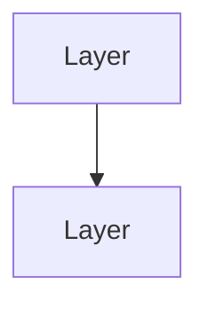

# Architecture Fixer

Analyze project architecture, evaluate SOLID principles, and **implement improvements directly**. Do not just report - refactor the code.

## Phase 0: Project Detection

First, identify the project stack and structure:
1. Check `package.json` for:
   - Frameworks (Next.js, Fastify, Expo, etc.)
   - Workspaces configuration (pnpm/npm/yarn workspaces)
2. Check `pnpm-workspace.yaml` for monorepo packages
3. Check `tsconfig.json` for:
   - Path aliases (`@/*`, `~/*`, `@components/*`, etc.)
   - Base URL and paths configuration
   - Project references (monorepo)
4. Check directory structure for architecture patterns
5. Check `docker-compose.yml` / `Dockerfile` for infrastructure
6. Check for ORM/database configurations
7. Check for scripts (`scripts/`, `*.sh` files)
8. Check for state management setup

Document detected stack, workspaces, and path aliases before analysis.

---

## SOLID Principles Architecture Analysis

### Single Responsibility (SRP)
- Does each module/directory have a clear, single purpose?
- Are concerns properly separated (UI, business logic, data access)?
- Are there "god modules" doing too much?

### Open/Closed (OCP)
- Can new features be added without modifying existing code?
- Are extension points provided (plugins, hooks, middleware)?
- Is behavior configurable without code changes?

### Liskov Substitution (LSP)
- Are abstractions properly implemented?
- Can implementations be swapped without breaking code?
- Are contracts clearly defined and followed?

### Interface Segregation (ISP)
- Are module interfaces focused and minimal?
- Are clients forced to depend on things they don't use?
- Should large modules be split?

### Dependency Inversion (DIP)
- Do high-level modules depend on abstractions?
- Is dependency injection used appropriately?
- Are external services properly abstracted?

---

## Project Structure Analysis

### Directory Organization
- Is the structure logical and discoverable?
- Are related files colocated?
- Is there a clear separation of layers?

### Module Boundaries
- Are module boundaries clear?
- Is there proper encapsulation?
- Are public APIs well-defined?

### Dependency Graph
- Are there circular dependencies?
- Is the dependency direction correct (inward)?
- Are external dependencies isolated?

---

## Stack-Specific Architecture

### If Next.js Detected
- App Router vs Pages Router consistency
- Server Components vs Client Components separation
- API routes organization
- Middleware usage
- Static vs dynamic rendering strategy

### If Fastify/Express Detected
- Plugin/middleware architecture
- Route organization
- Controller/Service/Repository layers
- Error handling strategy
- Validation approach

### If Expo/React Native Detected
- Navigation structure
- Platform-specific code organization
- Native module handling
- Asset management

### If State Management Detected (Zustand/Redux)
- Store organization and slicing
- Action/selector patterns
- Persistence strategy
- DevTools integration

### If Database/ORM Detected
First, identify the ORM: Drizzle, Prisma, TypeORM, Sequelize, Knex, or raw queries.

**Universal Checks:**
- Schema/model organization
- Migration strategy and tooling
- Connection pooling configuration
- Repository pattern usage
- Transaction handling patterns

**ORM-Specific:**
- **Drizzle**: Schema files, drizzle-kit migrations, `relations()`, prepared statements
- **Prisma**: Schema.prisma organization, prisma migrate, client generation
- **TypeORM**: Entity decorators, migration generation, repository pattern
- **Knex**: Migration files, query builder patterns, seed files

### If Docker Detected
- Service composition
- Network configuration
- Volume management
- Multi-stage build efficiency
- Development vs production configs

### If Monorepo/Workspaces Detected
- Package organization (apps/, packages/, libs/)
- Shared package dependencies
- Build order and dependencies
- Workspace protocol usage (`workspace:*`)
- Turborepo/Nx configuration (if present)
- Shared tsconfig and path aliases
- Cross-package imports

### If Scripts Detected (scripts/, *.sh)
- Script organization and purpose
- Environment variable handling
- Error handling in scripts
- Documentation of scripts
- CI/CD script integration

---

## Scalability Assessment

- Single points of failure
- Horizontal scaling readiness
- State management approach
- Caching strategy
- Database design and indexing
- Connection pooling

## Maintainability Assessment

- Code coupling levels
- Component cohesion
- Abstraction appropriateness
- Configuration management
- Environment handling
- Documentation coverage

## Technical Debt Inventory

- Areas needing refactoring
- Deprecated patterns in use
- Inconsistent implementations
- Missing abstractions
- Test coverage gaps

---

## Implementation

**Fix architecture issues directly:**

1. **SOLID Violations** - Refactor:
   - Split files with multiple responsibilities (SRP)
   - Extract interfaces for dependency inversion (DIP)
   - Create extension points instead of modifications (OCP)

2. **Structure Issues** - Reorganize:
   - Move misplaced files to correct directories
   - Create missing directories for proper separation
   - Extract shared code to proper locations

3. **Dependency Issues** - Fix:
   - Break circular dependencies
   - Add proper abstractions
   - Inject dependencies instead of importing directly

**Actions:**
- Create new files for extracted code
- Move files to correct locations
- Update imports after reorganization
- Add barrel exports (index.ts) where needed

## Output Format

After implementing fixes, report:

### Changes Made
| Type | Action | Details |
|------|--------|---------|
| SRP | Split | `utils.ts` → `date.ts`, `string.ts` |
| DIP | Extracted | Created `IDatabase` interface |
| Structure | Moved | `helpers/` → `lib/` |

### Architecture Diagram (After)

### Summary
- SOLID violations fixed: X
- Files reorganized: X
- Abstractions added: X
