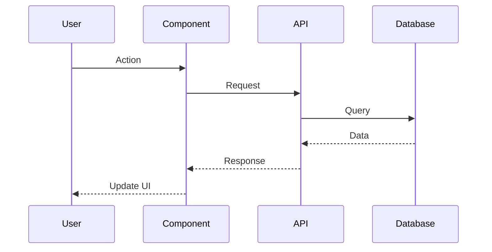
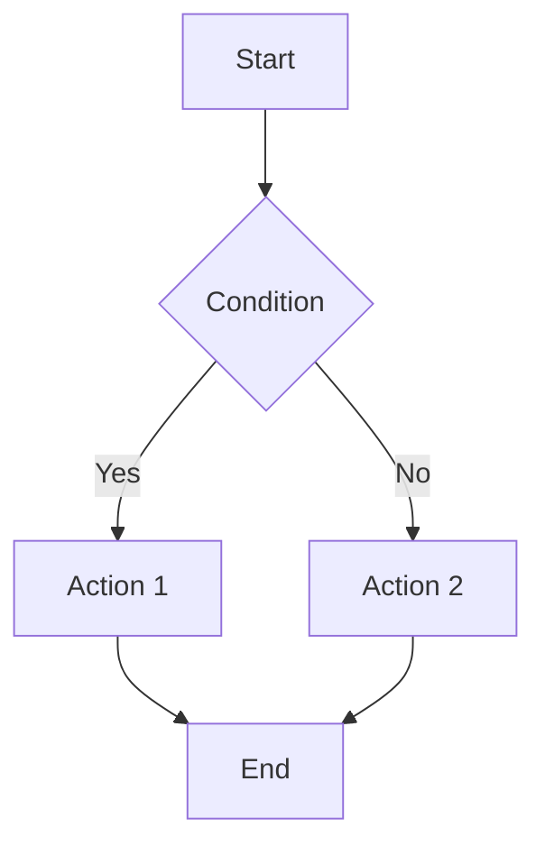
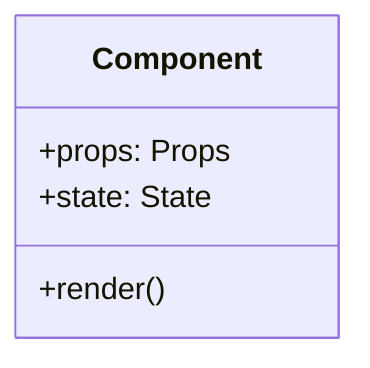

# Explain: $ARGUMENTS

Provide a comprehensive explanation of the specified code, adapting the explanation based on the project's stack.

## Phase 0: Context Detection

First, understand the context:
1. Identify what's being explained (file, function, feature, concept)
2. Check project stack from package.json
3. Check `tsconfig.json` for path aliases (`@/*`, `~/*`) to trace imports
4. Identify related files and dependencies using resolved paths
5. Understand the role in the overall architecture

---

## Explanation Structure

### 1. Overview
- What is this and what does it do?
- Why does it exist?
- Where does it fit in the architecture?
- Who/what uses this?

### 2. How It Works
- Step-by-step flow
- Key algorithms or logic
- Data transformations
- External dependencies involved

### 3. Key Components
- Main functions/classes/hooks involved
- Their individual responsibilities
- How they interact with each other
- Order of execution

### 4. Data Flow
```
Input → Processing → Output
```
- What data comes in (types, sources)
- How it's transformed (steps)
- What goes out (results, side effects)

### 5. Dependencies
- What this code depends on
- What depends on this code
- External services/APIs used
- Internal utilities/helpers used

### 6. Edge Cases & Error Handling
- Known edge cases handled
- How errors are handled
- Failure modes and recovery
- Validation logic

### 7. Usage Examples
- How to use this code
- Common patterns
- Anti-patterns to avoid
- Configuration options

### 8. Related Code
- Similar functionality elsewhere
- Shared utilities used
- Tests for this code
- Alternative implementations

---

## Stack-Specific Explanations

### If TypeScript
- Explain type definitions and their purpose
- Document generic parameters
- Explain type narrowing and guards
- Note any complex utility types

### If React/Next.js

#### For Components
- Props interface explanation
- State management approach
- Lifecycle and effects
- Render logic and conditions
- Server vs Client component reasoning

#### For Next.js Specific
- Rendering strategy (SSR/SSG/ISR)
- Data fetching approach
- Route handling
- Middleware effects

### If Fastify/Express

#### For Routes
- HTTP method and path
- Request validation (schema)
- Authentication/authorization
- Response format
- Error handling

#### For Plugins/Middleware
- Registration order importance
- Encapsulation scope
- Configuration options

### If Zustand/State Management

#### For Stores
- State shape and purpose
- Actions and their effects
- Selectors and derived state
- Persistence behavior
- Subscription patterns

### If Database/ORM

#### For Queries
- What data is being accessed
- Join relationships
- Index usage
- Transaction boundaries
- N+1 query considerations

---

## Visual Aids

### Mermaid Diagrams

#### Sequence Diagram (for flows)


#### Flowchart (for logic)


#### Class/Component Diagram (for structure)


---

## Output Format

### Quick Summary (TL;DR)
One paragraph explaining the essence.

### Detailed Explanation
Following the structure above, adapted to what's being explained.

### Key Takeaways
- Most important points to remember
- Common mistakes to avoid
- Performance considerations
- Security considerations (if relevant)

### Further Reading
- Related documentation
- External resources
- Related code to explore
